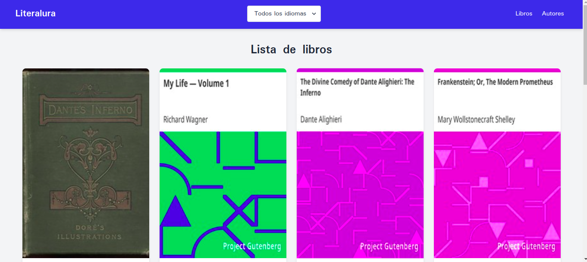

# Convertidor de texto de Texto



## Descripción

La tarea consistía en consumir la API de libros llamada Gutendex y, a través de una aplicación de consola, traer la información y guardarla en una base de datos SQL. El objetivo era almacenar datos de Libros y Autores, utilizar JPA para realizar consultas en la base de datos y mostrar los resultados en consola.

## Tecnologías Utilizadas

- Java
- Spring Boot
- RestAPI
- JTE
- Tailwind

## Instalación

1. Clona este repositorio en tu máquina local:
    ```bash
    git clone https://github.com/Juan-Garavito/literalura
    ```
2. Navega hasta el directorio del proyecto:
    ```bash
    cd literalura
    ``` 

## Uso

1. Abre con Intellij o IDE de confianza.
2. Ejecutar proyecto desde el IDE.
3. Utilizar aplicación por consola o abrir en el navegador http://localhost:8080/ 

## Desarrollado por

- **Nombre:** Juan Camilo Lozada Garavito
- **LinkedIn:** https://www.linkedin.com/in/juancamilogaravito/
- **GitHub:** https://github.com/Juan-Garavito


